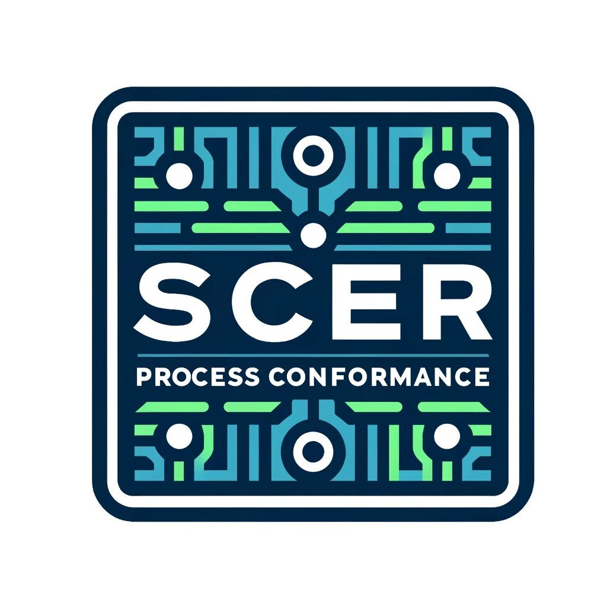
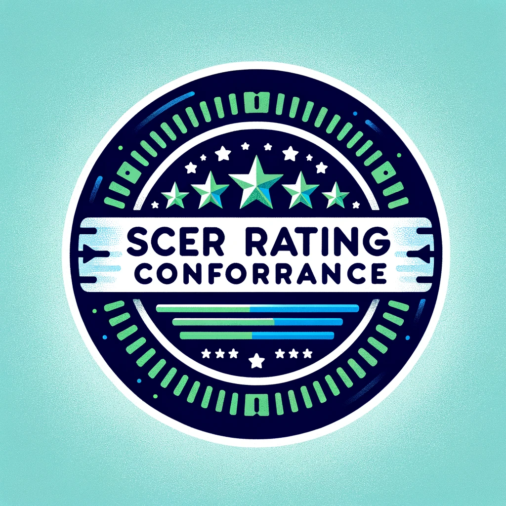

### SCER Certification Program for LLMs

**Introduction:**
The SCER (Sustainable Carbon Efficiency Rating) certification program for Large Language Models (LLMs) aims to promote transparency, accountability, and environmental responsibility in the development and deployment of AI technologies. The program is inspired by successful initiatives like [NutriScore](https://www.santepubliquefrance.fr/en/nutri-score) and [Energy Star](https://www.energystar.gov/), providing a clear and standardized framework for assessing and communicating the carbon efficiency of LLMs.

**Certification Levels:**
The SCER certification program has two levels:

1. **SCER Process Conformance Certification Program**
   - **Description:** This certification level ensures that organizations adhere to the SCER standardized framework and complete the four-step process.
   - **Instructions:**
     1. Complete the four-step process outlined by [SCER for LLMs](https://github.com/chrisxie-fw/scer/blob/Dev/use_cases/SCER_FOR_LLM/SCER_For_LLM_Specification.md):
        - **Step 1:** LLMs Categorization
        - **Step 2:** Carbon Benchmarking
        - **Step 3:** Rating
        - **Step 4:** Visuals and Labelling
     2. Report usage and conformance to the [SCER Working Group (WG)](Reporting.md) within the Green Software Foundation (GSF).
     3. Use the SCER Process Conformance Label
   - **Outcome:** Organizations meeting these criteria are granted the right to display the SCER Process Conformance label on their products or services.
   - **Label:** 
   
      
   
      (Experimental label image)
   
2. **SCER Rating Certification Program**
   - **Description:** This certification level assesses the actual carbon efficiency rating of the LLMs and provides a rating based on the SCER framework. Achieving this certification also implies compliance with the Level 1 SCER Process Conformance Certification.
   - **Instructions:**
     1. Use the SCER for LLMs process to obtain a carbon efficiency rating.
     2. Display the rating on the relevant products and services.
     3. Report usage and rating to the [SCER WG in GSF](Reporting.md).
   - **Outcome:** Organizations meeting these criteria are granted the right to display the SCER Rating label on their products or services.
   - **Label:** 

      
      
      (Experimental label image)

**Reporting Requirements:**
- Both certification levels require organizations to report their usage and conformance or rating to the SCER WG in the GSF.
- Organizations are encouraged to voluntarily report any changes when their conformance status is altered.

**Standards and Compliance:**
- SCER standards are periodically reviewed and updated to reflect technological advancements and market changes, ensuring the label remains a mark of high carbon efficiency.
- The SCER WG monitors compliance through ongoing testing and market surveillance.
- Products or services found to be non-compliant can have their certification revoked.

**Summary:**

The SCER certification program for LLMs is a comprehensive initiative designed to encourage sustainable practices in AI development. By providing clear guidelines and rigorous standards, SCER aims to reduce the carbon footprint of LLMs and promote environmental responsibility within the AI industry.