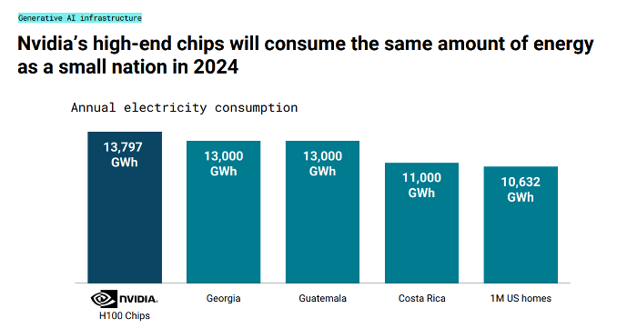
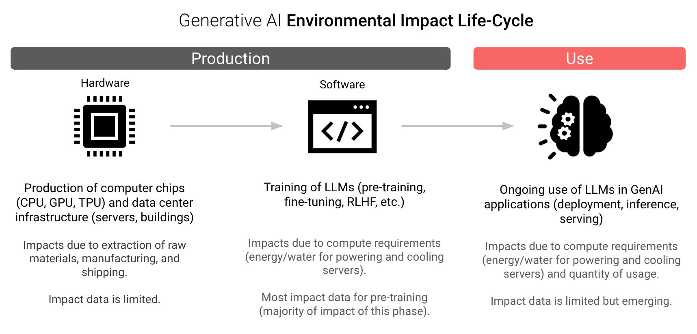
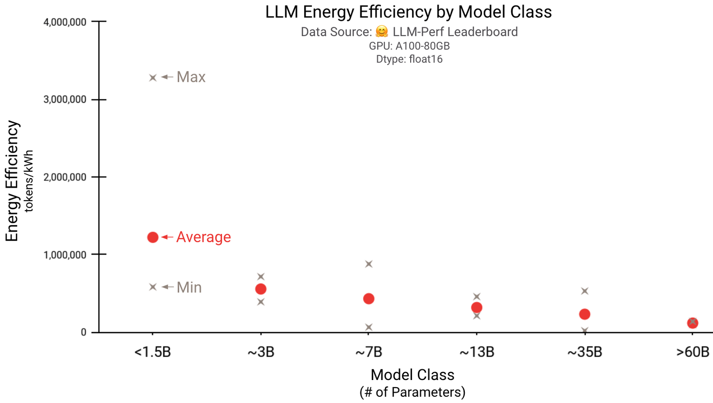
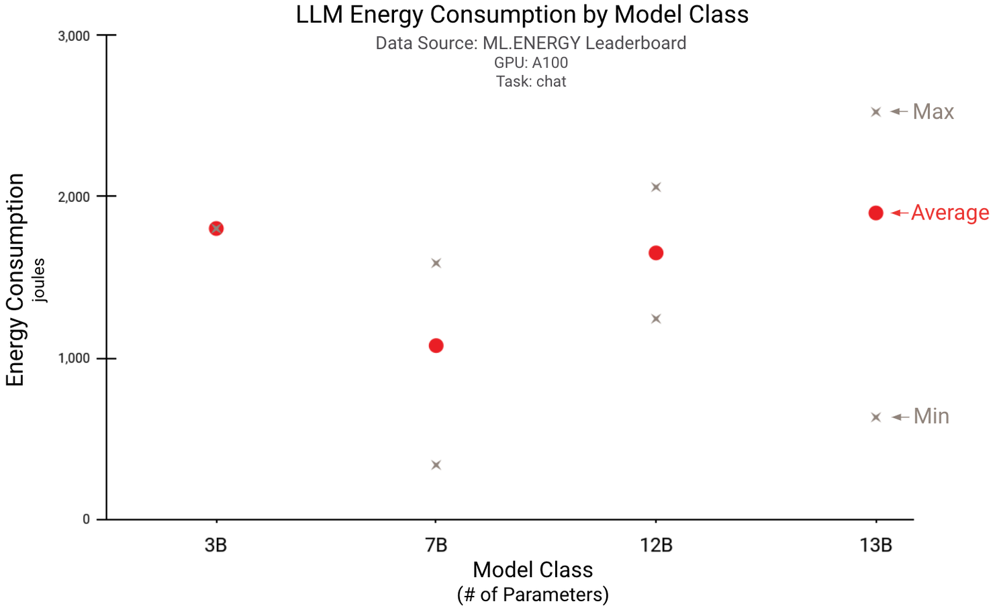
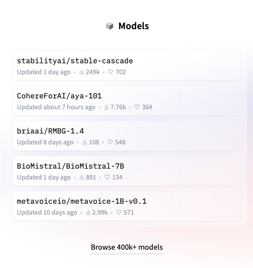

# SCER for LLM Work Plan

## Background and Motivation

Now that the SCER specification is fully developed, there's an apparent gap in its application, primarily due to the lack of use cases that demonstrate its utility. The recent rapid AI development reveals a critical need in the Generative AI (GAI) domain: a standardized method for evaluating and comparing the carbon efficiency of Large Language Models (LLMs). Therefore, the aim of SCER for LLM is to establish a framework that provides a relative or absolute rating of LLMs carbon efficiencies. 

## Landscape Research and Analysis 

### Energy Consumption by LLMs

Recent advancements and policy mandates on AI's energy needs underscore the importance of sustainable practices in AI development. An in-depth analysis of the current energy consumption trends by LLMs is essential. For a comprehensive overview, refer to the study at [NNLabs on Power Requirements of Large Language Models](https://www.nnlabs.org/power-requirements-of-large-language-models/).
 

Source: [CBInsight GenAI Predictions for 2024](https://www.cbinsights.com/research/report/generative-ai-predictions-2024/)

### Energy Consumption vs. Carbon Footprint:
  - **Energy Consumption**:
    - Measures the electrical power LLMs require, in kilowatt-hours.
    - Focuses on direct energy use by hardware for operations like training and inference.
  - **Carbon Footprint**:
    - Accounts for CO2 and other greenhouse gases emitted due to LLMs' energy use, measured in CO2e.
    - Considers both direct and indirect emissions, including the energy source's environmental impact.

- **Key Differences**:
  - Energy consumption is a direct measure of electricity used, not reflecting the energy source's carbon intensity.
  - The carbon footprint offers a comprehensive view of environmental impact, including the emissions from producing the consumed energy.

- **Relationship**:
  - While related, they're not equivalent; the carbon footprint also accounts for the type of energy source, making it possible for high energy consumption to have a low carbon footprint if renewable energy sources are used.

When rating the carbon efficiencies of LLMs, CO2e (carbon dioxide equivalent) may be the preferred unit over kWh (kilowatt-hour) because:

- **CO2e** measures the comprehensive environmental impact, including all greenhouse gas emissions related to energy consumption of LLMs. It accounts for the carbon intensity of different energy sources, offering a holistic view of an LLM's carbon footprint.
  
- **kWh** only reflects energy consumption without indicating the environmental impact or carbon intensity of the energy source.
### If the underlying CO2e measuring test bed stays the same, is CO2e still prefered than kWh?
Using CO2e enables meaningful comparisons and insights into the sustainability and environmental friendliness of LLM technologies, aligning with global sustainability objectives.
Even with a standardized CO2e test bed, using CO2e over kWh for rating LLMs is preferred due to:

- **Consistent Environmental Impact Measurement**: Ensures comparability and reflects the true environmental cost.
- **Sustainability Goals Alignment**: Emphasizes reducing greenhouse gas emissions, promoting environmentally friendly AI technologies.
- **Comprehensive Emissions Accounting**: Captures all greenhouse gases, offering a more accurate assessment of climate impact.
- **Renewable Energy Incentive**: Encourages the use of cleaner energy sources by showcasing lower CO2e ratings for LLMs powered by renewable energy.

This approach focuses on environmental sustainability and the broader impact of LLMs beyond mere energy consumption.

### Separating the carbon efficiency ratings of LLMs into training and inference phases 

1. **Different Energy Profiles**: Training is more energy-intensive than inference, necessitating distinct evaluations.
2. **Lifecycle Insights**: Offers clear insights into where interventions can most effectively reduce the carbon footprint.
3. **Operational Efficiency Optimization**: Enables identification of optimization opportunities for both training and inference.
4. **Transparency and Accountability**: Enhances understanding of the environmental impact of developing and using LLMs.
5. **Encourages Sustainable Practices**: Motivates the development of energy-efficient algorithms and greener AI lifecycle practices.

Assessing training and inference separately improves the accuracy of carbon efficiency ratings and supports minimizing the environmental impact of AI technologies.

### GenAI Life-cycle Environmental Impact
Here is a great article from [LinkedIn Post on MPG for LLMs](https://www.linkedin.com/pulse/mpg-llms-exploring-energy-efficiency-generative-ai-gamazaychikov/). Here are some brief excerpts:

### Food for thoughts:
- **Please note that the LLM's measurements from Huggingface and ML.Energy are measured in Energy Consumption units(tokens/kwh/joules), not CO2e.**

- **According to "GenAI Life-cycle Environmental Impact", measuring CO2e for LLMs may involve too much more to account for CO2e measurement?**

- **Does it mean that in principle, the measurement should be done in CO2e, but in reality, kWh is more practical?**

### A Case Study: Hugging Face's Initiatives on LLM's Carbon Footprint

Hugging Face, an AI startup, has taken notable steps toward understanding and mitigating the environmental impact of large language models (LLMs). These models, while powerful, have a hidden cost: their substantial energy consumption during training and operation. Here are more details on some of Hugging Face's initiatives:

1. **Estimating Broader Carbon Footprint**:
   - Hugging Face's pioneering involves estimating the **whole life cycle emissions** of LLMs, not just those during training.
   - They calculated emissions for their own LLM, [**BLOOM**](https://huggingface.co/bigscience/bloom), which was launched recently.
   - The process involved considering various factors:
     - Energy used for model training on a supercomputer.
     - Manufacturing energy for the supercomputer's hardware.
     - Energy needed to maintain computing infrastructure.
     - Energy consumed during BLOOM's runtime.
   - By using the [**CodeCarbon**](https://codecarbon.io/) software tool, they tracked BLOOM's real-time carbon dioxide emissions over 18 days.
   - The result: BLOOM's training led to **25 metric tons** of carbon dioxide emissions.
   - However, when accounting for manufacturing, infrastructure, and operational energy, this figure doubled to **50 metric tons**.
   - Remarkably, BLOOM's emissions are lower than other LLMs of similar size due to being trained on a French supercomputer powered mostly by **nuclear energy**, which emits no CO₂. In contrast, models trained in regions relying on fossil fuels may be more polluting.

2. **Daily Emissions**:
   - After BLOOM's launch, Hugging Face estimated that using the model emitted around **19 kilograms** of carbon dioxide per day.
   - To put this in perspective, it's akin to the emissions produced by driving approximately **54 miles** in an average new car.
   - By comparison, OpenAI's **GPT-3** and Meta's **OPT** emitted over **500** and **75 metric tons** of CO₂ during training, respectively.
   - GPT-3's higher emissions partly stem from being trained on older, less efficient hardware.

3. **Setting a New Standard**:
   - Hugging Face's work sets a precedent for organizations developing AI models.
   - It provides much-needed clarity on LLMs' carbon footprints.
   - As we continue to explore AI's environmental impact, initiatives like these are crucial for responsible development and deployment.

Hugging Face's efforts shed light on the carbon footprint of LLMs, emphasizing the need for sustainable practices in AI development. 

### Carbon Footprint Estimation Tools for LLMs
A critical examination of the existing tools designed to measure the carbon footprint of LLMs will help reveal their strengths and weaknesses. A gap analysis will help identify the unmet needs in the current ecosystem. 

**CodeCarbon** is an open-source software tool designed to estimate the carbon footprint associated with the computing power used for training AI models, including Large Language Models (LLMs). It tracks the energy consumption of computing resources and estimates CO2 emissions based on the energy mix of the location where the computation occurs. CodeCarbon aims to raise awareness about the environmental impact of computational tasks and encourage more sustainable practices in AI research and development.

**Equivalents and Similar Tools**:

1. [**ML CO2 Impact**](https://mlco2.github.io/impact/): A tool that calculates the carbon impact of machine learning models by considering the energy consumption and the specific energy grid's carbon intensity.

2. [**Green Algorithms**](https://www.green-algorithms.org): Offers a way to estimate the carbon footprint of computational tasks, providing insights into the environmental impact of research computations.

3. [**Carbontracker**](https://github.com/lfwa/carbontracker): This tool monitors and predicts the energy usage and carbon footprint of training deep learning models, allowing researchers to understand and reduce their models' environmental impact.

**Tools Comparison**

| Tool            | Pros                                                     | Cons                                                      |
|-----------------|----------------------------------------------------------|-----------------------------------------------------------|
| **CodeCarbon**  | - User-friendly and easy integration. - Supports multiple environments. - Provides actionable insights. | - Depends on accurate energy mix data. - Limited real-time energy source tracking. |
| **ML CO2 Impact** | - Simplifies carbon emissions calculation for ML projects. - Raises environmental impact awareness. | - Requires manual input of energy data. - Lacks real-time monitoring.               |
| **Green Algorithms** | - Broad estimation capabilities beyond ML. - Offers offsetting recommendations. | - Overly simplistic estimations for complex tasks. - Might not capture computing nuances. |
| **Carbontracker** | - Real-time energy and carbon footprint tracking. - Useful for comparing model efficiencies. | - Best suited for deep learning, not all computational tasks. - Integration requires more effort. |

## SCER for LLM Overview

SCER for LLM proposes a standardized approach to measure and rate the carbon efficiency of LLMs. This initiative is positioned to bridge the identified gaps by providing a clear specification for evaluating LLMs' environmental impact. SCER aims to facilitate the adoption of more sustainable practices in the development and deployment of generative AI technologies.
### The case for SCER for LLM

**The Question**: Why carbon efficiency ratings are not part of the evaluation parameter in the most popular LLMs in Hugging Face? Is it because Carbon Efficiencies of LLMs are still not a priority in evaluating LLMs for deployment/applications?

## Goal and Vision of SCER for LLM

The primary goal of SCER for LLM is to promote transparency and accountability in the AI sector by standardizing the measurement of LLMs' carbon efficiencies. The vision encompasses a future where all stakeholders in the AI ecosystem, from developers to end-users, are empowered to make informed decisions based on the carbon efficiency ratings of LLMs. Ultimately, SCER for LLM seeks to encourage the development of more carbon-efficient AI technologies, contributing to the global efforts to fight climate change.

## Action Items

1. **Research and Analysis**:
   - Conduct a comprehensive review of the latest development regarding AI carbon footprint trend and concerns
   - Perform a gap analysis on existing carbon measurement tools, highlighting areas for improvement or innovation.
   - Research on  Hugging Face's carbon efficiency evaluation process for LLMs, and to identify potential gaps and opportunities where SCER for LLM can provide value. 

3. **Stakeholder Engagement**: Engage with key stakeholders across the AI ecosystem, including technology developers, regulatory bodies, and end-users, to gather insights and foster collaboration.

4. **Standard Development**: Based on the gap analysis, develop or enhance tools that accurately measure the carbon efficiencies  of LLMs in various operational scenarios. This includes the software categorization, benchmark definition, rating method, algorithm, and visualization and labelling.

5. **Pilot Testing**: Implement pilot projects to test the efficacy of SCER ratings for LLMs in real-world applications, collecting data to refine and validate the SCER framework.

6. **Outreach and Education**: Launch initiatives aimed at raising awareness about the importance of carbon efficiency in LLMs, targeting both the AI community and the broader public.
