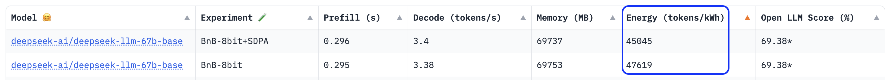
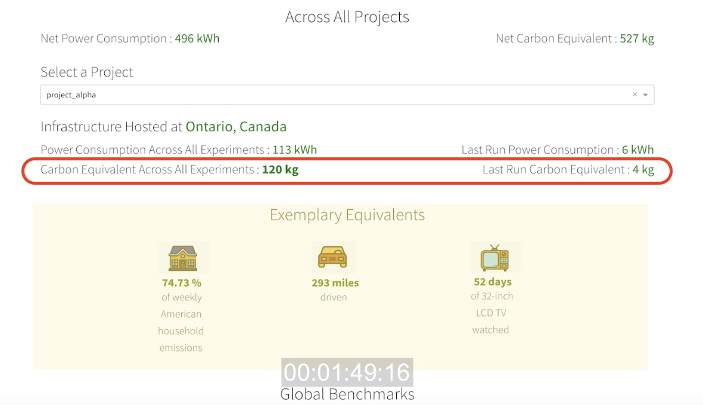
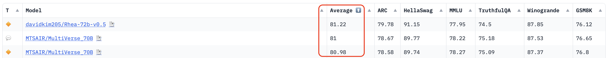
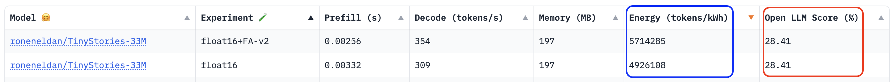

## SCER Specification for Rating  Carbon Efficiencies of LLMs

**Motivation and Value Statement for the SCER Specification for LLMs:**

The SCER (Software Carbon Efficiency Rating) specification, pronounced “sheer”,  provides a crucial framework designed to standardize the assessment and comparison of software applications based on their carbon efficiencies. Without an industry-standard approach to measure the environmental impact of software, there is currently no systematic method to assess or compare the "greenness" of software relative to similar applications within the same category. By adopting this specification, software "greenness" is established and recognized as a key performance indicator (KPI) in the evaluation of software solutions. This not only promotes a focus on sustainability but also advances the broader agenda of sustainable software development, aligning with global environmental goals.

The SCER Specification for Rating  Carbon Efficiencies of LLMs  serves as a practical application for [the foundational SCER specification](https://github.com/Green-Software-Foundation/scer/blob/Dev/Software_Carbon_Efficiency_Rating/Software_Carbon_Efficiency_Rating_Specification.md). Following the standard process outlined in the SCER specification, the components detailed below are designed to assess the carbon efficiencies of LLMs:
1. Software Categorization (model size, types, etc)
1. Benchmark definition (workload, method, tools/infra, etc)
1. Rating definition (range, algorithm, etc)
1. Visualization and Labeling (visuals, placement, access to sources/details, etc)

---
Below, each component of the specification is defined in detail, using Hugging Face as a case study or example.

### 1. Software Categorization
- **Sub-categories for LLMs**
  - Define categories based on:
    - Model size (e.g., small, medium, large, extra-large)  
    - Application type (e.g. text generation, translation, summarization)
    - In [Hugging Face Open LLM Leaderboard](https://huggingface.co/spaces/HuggingFaceH4/open_llm_leaderboard), more sub-categories/filters are defined:
        - Model types (pretrained, continuously pretrained, fine-tuned on domain-specific datasets)
        - Precision (float16, bfloat16, 8 bit, 4 bit, GPTQ, etc)
        - Model sizes (1.5 to 70+ billions of parameters)
  
  *Note*: In Generative AI, application types can include text (via LLMs), pictures, videos (such as [Sora by OpenAI](https://openai.com/sora)), music/sound (including Meta's AudioCraft, Google's MusicFX, and [Suno](https://suno.com/)), speech, and data synthesis, etc. While the current specification is tailored to LLMs, future versions may expand to cover other Generative AI application types. Nonetheless, the general methodology described herein is applicable across all types of applications.
  
### 2. Benchmark Definition
- **Standard Workloads**
  - Identify common tasks for LLMs that reflect real-world usage, like text completion, language translation, and fine-tuning performance.
  - In Hugging Face, a set of [6 benchmarks or workloads](https://huggingface.co/datasets/open-llm-leaderboard/results) (mostly as open source projects or from research papers) are run against the submitted LLMs:
    1. AI2 Reasoning Challenge (ARC) - Grade-School Science Questions (25-shot)
    1. HellaSwag - Commonsense Inference (10-shot)
    1. MMLU - Massive Multi-Task Language Understanding, knowledge on 57 domains (5-shot)
    1. TruthfulQA - Propensity to Produce Falsehoods (0-shot)
    1. Winogrande - Adversarial Winograd Schema Challenge (5-shot)
    1. GSM8k - Grade School Math Word Problems Solving Complex Mathematical Reasoning (5-shot)

- **Measurement Methods**
  - Develop methodologies for measuring carbon efficiency, including real-time monitoring or simulating typical deployment scenarios.
  - Hugging Face uses [CodeCarbon](https://mlco2.github.io/codecarbon/) to measure energy consumption. CodeCarbon takes into consideration of the GPU, CPU, RAM and location of the machine.  Hugging Face uses kWh in evaluating the energy efficiencies of LLMs: 
  
  - CodeCarbon does provide CO2e information, in addition to kWh:
- **Tooling and Infrastructure**
  - Specify required tools or platforms for conducting benchmarks to ensure *reproducibility* and transparency in the testing process.
  - From Hugging Face [LLM-Perf Leaderboard](https://huggingface.co/spaces/optimum/llm-perf-leaderboard): 
    - Hardware: [H100 80GB 350W](https://www.amazon.com/NVIDIA-Graphic-Memory-900-21010-0000-000-Warraty/dp/B0C957FN64?source=ps-sl-shoppingads-lpcontext&ref_=fplfs&psc=1&smid=A3LRS18WTQPMZ4), [A100 80GB 275W](https://www.cdw.com/product/pny-nvidia-a100-80gb-pcie-gen-4-graphic-card/7065275), and [RTX4090-24GB-450W](https://www.bestbuy.com/site/nvidia-geforce-rtx-4090-24gb-gddr6x-graphics-card-titanium-black/6521430.p?skuId=6521430) are the GPU hardware used in the benchmark infrastructure
    - Software: 
        - [optimum-benchmark](https://github.com/huggingface/optimum-benchmark): A unified multi-backend utility for benchmarking Transformers, Timm, Diffusers and Sentence-Transformers with full support of Optimum's hardware optimizations & quantization schemes.
        - [Eleuther AI Language Model Evaluation Harness](https://github.com/EleutherAI/lm-evaluation-harness), a unified framework to test generative language models on a large number of different evaluation tasks, is used to evaluate LLMs on 6 key benchmarks.

### 3. Rating Definition
- **Efficiency Range**
  - Determine what constitutes low, medium, and high efficiency based on carbon output per unit of computational output or per unit of software function (USF), e.g. carbon per 1,000 tokens/words generated.
  - *LLM Performance Efficiency*: Hugging Face uses the average score of 6 performance benchmark results, in the range of 0 to 100:
  
  - *LLM Energy Efficiency*: measured in ''tokens/kWh''. Hugging Face uses CodeCarbon to get energy consumed number in kWh, which is then divided by the number of tokens generated, as shown here:
    
    One observation is that there appears to be a trade-off between energy efficiency and performance in LLMs; as energy efficiency increases, average performance tends to decrease. This pattern is understandable given that larger language models typically outperform smaller ones but at the expense of higher energy consumption, as demonstrated here:
    
  - *LLM Carbon Efficiency*:  It appears that Hugging Face's datasheets do not currently include a specific metric for carbon efficiency. Instead, data on LLM energy efficiency,  measured in tokens per kilowatt-hour (kWh), might be used as an indirect indicator of an LLM's carbon efficiency. 

- **Rating Algorithm**
  - Develop an algorithm to calculate efficiency scores, incorporating factors like efficiency under different loads and overall operational carbon footprint.
  - Hugging Face uses CodeCarbon to get energy consumed in kWh, which is then divided by the number of tokens generated
  - Rating Scale: The performance rating scale for Hugging Face's large language models (LLMs) ranges from 0 to 100. Currently, there is no specific scale for measuring energy efficiency. Hugging Face measures the energy efficiency of LLMs in terms of tokens per kilowatt-hour (kWh), rather than measuring carbon efficiency in CO2 equivalent per Unit of Software Function (USF) or computational output, e.g. carbon per 1000 tokens generated. However, if the benchmarking infrastructure used is consistent, then energy efficiency could be correlated with carbon efficiency.

  - Recommendations:
    1. To effectively showcase the carbon efficiencies of LLMs, it is recommended to measure and present the CO2e emissions per x number of tokens generated.
    2. Implement both a relative rating scale and absolute CO2e values: Calculate the ratings of each LLM's carbon efficiency among all the submitted LLMs in the same category. This approach will enable users to easily identify the most carbon-efficient LLM among those submitted in the same category.

- **Compliance and Thresholds**
  - Set thresholds for ratings that align with industry standards or regulatory guidelines for energy efficiency.
  - At present, the industry lacks a clear consensus on establishing thresholds, let alone on compliance. 

### 4. Visualization and Labeling
Visuals and labeling are crucial elements of the specification because a key objective is to facilitate the clear and intuitive presentation of an LLM's carbon efficiency. This enables users to easily understand and compare the carbon efficiency of different LLMs, helping them make well-informed decisions when selecting models.
- **Design of Labels**
  - Create visually distinctive labels that clearly communicate the carbon efficiency rating of an LLM, similar to energy efficiency labels on appliances.
- **Integration Points**
  - Specify how these labels will be integrated and displayed on platforms like Hugging Face or benchmarks like MLPerf, or if the rating is for an organization's internal consumption, choose an appropriate integration point.
- **User Access and Transparency**
  - Ensure that the labels are easily accessible and understandable to users, providing detailed explanations of the ratings through tooltips or supplementary guides.

## Observations
### Gaps, Opportunities, and Observations
    
- Currently, Hugging Face presents an extensive array of data for LLM benchmark results. The challenge lies in the usability of this raw data. Finding ways to simplify and clarify this vast amount of information to assist users in making informed decisions presents a significant opportunity for enhancement.
- It seems that there is a trade-off between carbon efficiency and performance efficiency in large language models (LLMs). More accurate and high-performing LLMs, which often have billions of parameters, inherently require more energy for training and inference.
- An effective strategy to reconcile performance with carbon efficiency could involve developing smaller, domain-specific LLMs. These models would be more carbon-efficient due to their reduced size but would remain highly performant and accurate by training exclusively on domain-specific data. This approach allows for maintaining the utility of large models where necessary, while also providing an option that requires less energy. Additionally, it suggests that such models should be evaluated and rated using distinct benchmarks tailored to their specific categories.
### Potential Beneficiaries of Adopting SCER for LLMs Specification
Any organization that evaluates or distributes LLMs (AI models) internally or externally can benefit from adopting the SCER for LLMs specification, because SCER specification and its certification enhance credibility, ensure regulatory compliance, attract sustainability-conscious consumers and stakeholders, and boost brand recognition.

Governments and standard-setting bodies (SDOs) can greatly benefit from adopting the SCER for LLMs specification. For governments, these standards ensure industry-wide adherence to best practices in carbon efficiency for AI models used in public services and the broader industry, aligning with national and international sustainability goals. They also aid in regulatory oversight, enabling more effective monitoring and enforcement of sustainability practices in AI development.

For SDOs, the SCER for LLMs specification offers a clear and consistent framework for evaluating the sustainability of LLMs, promoting uniformity and comparability across the industry. This facilitates the development of robust certification programs like the SCER Certification Program, enhances industry-wide carbon-efficient best practices, and drives innovation in sustainable AI technologies.

## References

### Sample Illustrations of SCER Rating - Visualization and Labeling

### Nutri-Score:
Nutri-Score is a front-of-package nutritional label that converts the nutritional value of food and beverages into a simple overall score. It is based on a scale of five colors and letters: 
- A: Green to represent the best nutritional quality
- B: Light green, meaning it's still a favorable choice
- C: Yellow, a balanced choice
- D: Orange, less favorable
- E: Dark orange to show it is the lowest

The Nutri-Score calculation pinpoints the nutritional value of a product based on the ingredients. It takes into account both positive points (fiber content, protein, vegetables, fruit, and nuts) and negative points (kilojoules, fat, saturated fatty acids, sugar, and salt). 

The Nutri-Score is calculated per 100g or 100ml. The goal of the Nutri-Score is to influence consumers at the point of purchase to choose food products with a better nutritional profile, and to incentivize food manufacturers to improve the nutritional quality of their products.

### Energy Guide and EnergyStar

[**Energy Guide:**](https://consumer.ftc.gov/articles/how-use-energyguide-label-shop-home-appliances) 
The Energy Guide label is a prominent yellow label found on many home appliances. It provides consumers with essential information about the appliance’s energy consumption and efficiency, allowing them to compare the energy use of different models. The label includes estimates of annual energy use, operating costs, and how the appliance compares to similar models in terms of energy efficiency.

[**Energy Star:**](https://www.energystar.gov/)
Energy Star is a government-backed program and symbol for energy efficiency, managed by the U.S. Environmental Protection Agency (EPA). Products that earn the Energy Star label meet strict energy efficiency criteria set by the EPA, helping consumers save money on energy bills while reducing their environmental impact. Energy Star covers a wide range of products, including appliances, electronics, heating and cooling systems, and even entire buildings.

### CDP:
[CDP](https://www.cdp.net/en/info/about-us) (formerly Carbon Disclosure Project): A global disclosure system for companies, cities, states, and regions to manage their environmental impacts.
- Data collection as a form of company disclosure: CDP provides guide that covers the key steps to disclose as a company including setting up a CDP account, responding to the CDP questionnaire(s), and receiving a CDP score. 
- A CDP score is a snapshot of a company’s environmental disclosure and performance. CDP's scoring methodology is fully aligned with regulatory boards and standards, and provides comparability in the market.

![](data:image/png;base64,iVBORw0KGgoAAAANSUhEUgAAAOAAAADgCAMAAAAt85rTAAAA9lBMVEX///+zKy7OBTjY3+HMACrw2NmtBAzw8fKvEhewHiGxISXz9PXY4ePNACXY5Obx3d7nn6vLACDXytDSjY/n6+zWucHIETbTjJm/HTLjvL23Jy/y8/TYnZ/hhZP21t17g42Zn6a2ur/PhIbHbnGGjZaOlZ2rAADNADCmq7HGyc3V19rbaHzffo9weYS+wsbtucLFkZPTv8GgpazLztF1fojerq/IAADFa2xlb3vzytLnxca2NjnUl5j26Ojbp6iCiZO9UVO6REZVYG7AW13UO1lMWGfLe3y1MzblkqDsq7jRH0XZW3HJhIa8S03EYmXXR2LJABPQa3a+vQKqAAAT/ElEQVR4nO2dC2PauJbHT9YBAbq9NIv24TVTS8Qismbs7PWjOAZDAg2Z6Uwys9//y+yRyQPyIKRJgWb4twZbNol+kawjrKMjgJ122mmnnXbaaaeddtppp5122mmnnXbaaZt08nGJfi02nb3X65eD/af1+dOms/d6/XT0b0/rYAZYnJmSHAwBhq3yOL/9eH4J6c3+WQ5bqFUAB3Vkgw7CVXIYtqHTbwI0BxVI06ZtdzFtCLltp4UzSJf/tg1oFcBG3ocZYHswOGy32pcF0G5aa3Y79mVerUxb01arn59VDu0ze7M4D7UCYKVmd5szwOGguOwVlUOsm8js1LGK0ipcTHvT1hD6FXt6tnVFuAJgbzq8miJgL8+Hg6HdnlTOKBTdymWlCvkZ7Ra9QV7pDOEi71ZOf0TAVgEFlp7darUrOf2jU8AUm5P80IYBNNum8WlNCzuHdpFPh1vX0CwAfv3y6D34Q2se8OAEft1/z4BfsfE/eAjIfJ8+81PiNeT0GzUHePQL/AZfjh4ARirOZhcjp6TXOzeiQF0DSG+SA7h3BTyW8Nyf7M00B3jwqTiC3z48AFQaEgj5CBR3rbECsFwpIZPMkz54XImxxSHC84J7APo8FG4cRR4kUUJi6bKIJ5qMeMgyxaTH8KfEdCSFpFqsF/ALfPz8iR48BPQw45kVxW5MQIJQmLERSZBFyDAEH0vQIx5YJLOkNiWoGLA4IRnEvhKEcoppVugyDpkOZeQQKSwI4zAiawXc/whFQeHno/uAkQVcZzomNA6oB9T85T3mghCMhz4eIyCTWOvwGgcgM4AJ4wYwBGukDWCsyIhFkMUx4w7heIUD3mgNfHOAB5T+dnwMJwcPSlCqBG9ETlzhUm6qaCBcLJRQYsm6AkuXjcATCZXK3KEj3wCKMcvAD1UkNY9kqL0owBIMpdKSMElcxYGvo4beAR79DL/99eFzE74+MBPEVCWCeWe44b5WpGwlCDVpuHv9Xp4vr5gllwcOSEZm12KCQ8wr7rKb9mp9gL//9OXm9Rk7yPwX/QrxOIhaSwHOVdGjo7vX5YB3ctaSx1dpla9Ld3IXDyO5tnx+s1YBjGNgLMSqGRtA5uP941vAtJVZoLG6Wr45HWIybpaFKfp62wL9tP8soPCVL6TvkUSP8fBcZw6PueUqFlg+j0d0rI211xlgIs3CCBvPMIqVrzbMVmoFQMI9gZbZxYI0lkti2YxlguYBD/EFTR5w0wPArgkPWABMmIL2PJlsFm2mVn3vaVUr5hIXLCGwu6ZV2c/0sO8WlMn4n1uQORI4M4Bo2iO0fpbAQx+3dXRUntUKgBr7kTH2ZkBKLDDIuATLkwQrYITl6VlUgSCg8J/wJHZLmU89icSm37Z5rQB4T97a8/gqvRyQrT2Pr9LLAX8w7QB/dO0AAdrDhU9M5w+nKUCxt84Mv1QrAJpn9lAYkpRCYSNTbkPRzMHOkdamgAn51pb1ioCV+qBf7LVrUOs07PR02km7h63D3rB1enhZVItuq7uthCsC/nE27Tbb01p+AR17cnV4kU4h7bfo1C5qRaNoQKu9aZIntCJge1Lk+SXtNqtwZfcGRQUB7War00kRsF7UYDJ87jdtSCsAthqNC+jVprR/elG0aldpcVZP0w7ke/0KAu4V/aJ+drphjie1CNh4DPB5NbvfN5Ov0QLg2dW3AdKtG9e90zwg8gzqzwDSrfgO9ALNA56hqas+BBTzD1fYo8+ZFOjnwZ94fPidNQdYH8AQThsPAWMdJaHngeABYRwi1yJ8pKKEAHcti7tCnyutwyjRwD3zOFe7vHyyEXohT0C5MaZHbLyRb5JzgNUC7Vla26vXavcAwxjOQWnJaEKiMATzFD4gVrkb4y5+CQ7DSIOL3+czasZfQisDX2BSBjqCzHHBo3wjjzDuABun0Mb+SNW4jBw2FgHNAJowoygZiZTHI6aQianI4ypW4M4AGbj4lxg5s2qcQSwwCT/nck448I0D1mwwYwyHjV7vsL9YgkJjoQgttfYIxyLzEXAELIoj6sfmUdSIhSFnWKouHePPyBzFMsbNw6cALKSn5pkb30j7dAdYBTpMsd9cbTQaC1VUM4tBCHjjiQhobB6YYVvqX+8ybc4pZmmKO1qYKkq4D4yHlnYwCTSSxRBTLMZNAjawc9mtdZvQf9JMrDAcNFLb9jT/rgRPewbtsvc04CrauuGYuVa0Mfc6D8jnn6M9BkA2ZOKuRdkSOX8839mW2sJXXfZiaMbMgCgeEAssq0yzMjOcac1t6xWzluiffzSeBeRSoa3zXbR5GcuQTXLF2XkYqigkQZjoDO2CFJ4llNRCeOseVSKvBZRozeKRGLNEsHKE0CRYCqiIIqUBrT82P5hOxyLi/vof2L8FYKAVOA4h2Q1gYEw99ttEDNoAmmEZlqEdtdY1NP2GgNxzQxhJDxLugVSzBAQM3RGHRBrnEE6Fl5DY9XTojdZdhK8GnPlLOHDrriVn3hSw4NV1/319egPAewq3YuDvVm8PuGXaAe4At1w7wB3glov8Y4n++Uet/rS2dshoQcW/L9OwtUSdH2L+4K9/fXhan483nb3X6+Myb7QP7wzQFNrRewY8OT45XvAvfG+AQD8V8OngHQMef/7chA/vGPDk6AstHinBwhiE5kbz+c1aADT6/egh4GG3gMGKdn2yZdZxsQS/fvkEjzQy04sh9OtN+7IHrc6ZDYeXKQwuD/Niclqk08tBbwLFZGJ222n3arNA93X/HvwIfx49BGxNmleXzXbl1L4a5mdFO683u8Uk7Q3S02Gv6Ban9mQ4vGp3ml3Yth7qAmBxfAKw/0gJDnun+UVz0jq1e3nzrNkf7lUuYZqeXk1b7Q7UoGf3e9PBoE270N3iKtqsNJvHXx67Bwe2KZpuupdO7MpFejnsFt12Px1M0nQwhS5M7NbVMG0NELDW2izQfc0DHqDmZ0DeAlaakINNm2leyQtq/OxsyO1TfBnSZgXwvQA7pXiZDZUtm0r+zX3Ryd5kfbl8hd59Z7td+5+nVbv2UZLS88wgWTm3hS/9eVSSu9GH27Gy+emqlJgZFWvTcNkI4A3gzDMiJuCC4zDzmMOMzZvsEzPDOjbOLxbm3MI3DwglmIKp1I3BwQscXbpQxGZ8UIOQBhx/GGHrGKdYHdDTAXWdAAIYh54WXGSYHsQBZDqDSChhjS2llMciP4gzcK3McUOS6AQvGBPzeZfgVZHyqAtZHBCJV28ToFYB8c4pJFiOsZ+UU+KVxpIK8RBhMyvEc+Ax5ft4LlZjMMNKIvNFWUWZcjVWcaIVeJYCS3G6jnkyqwMmEDFXu/ieIJFbAooYYsxwOR8rsMQcIH5iZABDoHiBqaJjEBqBzPUjIsEX0tkiQI45lybXIvYwW7HPAllOMvNUOStLuy7DEtSBx5mKfSxkV2ZOOAITNQA/Scy4YRAz19XEjGlHnov4zzRYawR8KM301vi8LPOjYP+7CFivNlYDBLHusegnRZc+u54HNFcXV43VAGGl4VpCvv+o7gsAK9M2QHVlwGiZ49LMAmAjU85P/p56AWDexa/ttUcApSRESVMpLWxVRORh/gnaB7RpoSdA4LtWXiy58ZuhsfKs8FwTbF9CBIwdhifMJig1n7Fwe0Mb/wLAYmhDWqtXq/VFQMxSwFwIHGMslM6oH0ZMMZdmYJkpugHVIvSv3WIJV8YOuuBjqo+AEUuotvAaJinhsUDD78Eb3sEvADRfeNLukFK7tgCYzWZTewScc4k9EtCCRBJcmhiX7Tg0E5VD4zUa6kxKofQMUPJrQOpJihsYQGUMhxi9ocPTy6poCmeHw3ansQDIY5ag8XKxxcCCoNhNERCgWcc9E2qEBLOZ2BlaSa6pVfoqB5BgzywsAY3Bl1T43PK5jtDWi+vIQOsHrFXgsl6vN+7dgyqi1HitGm9WAT4w7FY7+O7PHFp90/8m+GYxc6k2u2FMuF/2yDUlkQCzUY7ljJgQ8jdseF5mJiBfvRXdEq0OOBgMWldzjei7A6zfVc73CfhAO8Ct0PsHXOpH8Q4AyX8s07RbfVrdHwLw5PMSP4q/fi6aS7TJ+QAr69PBkke7R79sOnuv198M8MPBwf47Bjz6ekyLjx/eMSCF45P5CIzvDHD/V/j5r88n8G5L8MNxGV3y6yOA+Q9h8h7VPOBJCXj0COBFA6Ao/xmHmILS8s0c0pttWx1lHpTgfLzsG8DK6VVOu/iv1qxP96BbrZxO9mh9UrObjdNO8+Kw1+wfbpmDyI0W78Ff/vr86ZF7sNNOe3CWNtI+2O1uUS0qtbRv70G71ekNq/leWlRw2yzIU5pvRfcLOPkExx8eANb7/S4Manm3VbkoakWVVmp5XtQpAk4rdpG3L4p8sKXBixYN/W+VTz/N240ZoN0HmAwrDejntHFaa1YdmF5cGMBOsdefNvcmrebFaWfDJE9oEXD/4GDe53WJmaDzOxQ2MXNsNf3N+qKrA5KbEnvwCJNuR3TXG60EmAC7F6HXjL/P9OAhdIKA6tEnt+FbZnxVfTr4z6d19NPsooBmQELuA+UChHlC7QsNxgtCiRFoGRKIyvGSSEE8NkNG1BecyRjC8qIIwJcsPI/pegKAz6tSXfLUpX7dMgbnDlhmQCFwfKWYjCwhLGnFSvksoAG4bERCzLprWZ5xNQDJEua7kMGYitC3NLc4zC6M1z1LdyXAcewCZlEyE5uXiYgroqxMemqExzrEGjmWI1VW1+B6rvUILAUuCcCJmOQ8NK5QAVgjvma+1QAzrIpmQr8TYH2Ecx1iguU6QCINARkhT1C2NgElyXUJuqAVmFUHfOE6TOJBhD8mwsNtBDQhea0QQmoGYkFRKiBmVJpgvHhThTyxiJRmvF1KWg5eho4wQd8FzSIJzMMbVOENqULLfH4LAZeL+0/HjM7eLKPfqjcAXBZNbPNBfRcB67VaYymgNXu7H1RjIxbuRktncf7jXwsjfi077dUeAbyNW+CWb7G4TZxJw2wpCLjpl9K7D5HvHfR8dcBaxWRqLsDdDaCMEuByFAIT5b4cYYsSRWjoIhMVzDcmz6VuNIKAB0x5nhdl2N66LPI8Icbf2fStDNiYwrDbLeZcYa4B0QTGghPwgNNy3ywmQDI90sazUKB1DNA4+GgPLUwwMcQC42IYC1nubk0J1mzo7zWuWv3bodxrQB2hUePExP+a7ccIyBLLKrHQNpTmPYxBaLcEpMZfJrA04QySLQLMTVStRr0x7XQmjfkqmoiASka9OJ7tG/8WcIXEzhfuZjO/EBqIAMxiNNzCrmukBVcaAbG7Zm0VYK1apTd+lLeNjC6bDVq2LaZBodeJBGbrzZBydQETrWm2Sk25/Axj16e+cwCSlQHrQ7iqdbGe1m6MxWp2cNNavRXtQ9Fqz0fRfG+A9V5h1q9cZui3US8w9I1qozZ//O4A72sHuBXaAf7wgP9cpn91G0+r9kMA5v+1VIfLtK1B6Bf0cdmi6h9+3nT2Xq+lsziPdoDbrwXAo6P3Dfjlzz+/LES9eWeAByd4TH/ff8+AX/4s5pd0vgEsv8LeLZdub+t47WNaBDza/7LgZjADpN0+fp+/vHWUqG6r18tjWgREpvlBz1tAszRJj6aXHchxaxTF6VUBvdNK3oZJcXhYpGfburTOqoDQLbrNbtFudpu9/KLYs9tX7V5zYE/xRNWu1Iq9LYuUcqvVqigC0m5hX04Ks8hMA8uzUoPOxXAGCHbjsJcv/z0b0yLgn78/1sjQbvu0A91Kv7JX2RueVerFpHXYSVvpXt5PsWih6NqtbW14VjITaYoVMIVmKwc6yCGlMEwxoU0htVNq1i4bbGsB/q0M/fvvqj3QDSDji5ExnlopKLT82+fUYvOjm6VWAsyo9kxIitnU8AwcZ7ZfHptQDLMTVOjrfez6KDbrAJnDTYYHb+//9xL93+yiwAKqMiZVAnwkxqHvKw8LNVBjAtZYOEm5XMkoyixFVBSwUI60wlcvJm7EN7uaSXvZBKvG4ewiilmnEbDQs7gDCYS+GdqLQzDOEyPAA8mAeSC0IlyxcoEBRYxfDAs0DXm8QW+DVQBN6J4AATOsg5zcB3QXABkhI+sOEBzfCwXb4P24UgmOFBeQMVcFGpGkKAEzCISJ1sMVua6ieFoRqTwWcmmqKJex5QoOCW7bDVi6R9Jbt4+bNsOiCZ0dzk6w22udsl9TvjLYrLvIaoCPS3nxmnL5Cr0YcJU4KXSLfJjnARv1ev1ZwKVxzWa+dAL7AepR27eBQDlzgI3DVqtzUX8E0PJ8ECoCBUzjHgff05hgfEY8q1yrJQIdekScawcPDaAPoeIW1mGBBpOiMYTQY8LEUVlDuLAnAK9XVq09BHTBY2OqtAROPDh3cCeBsSPQwpFz4yjKYqF8ZtxdBRUmuAh4NHPC0ukVlB8zzbUqI5AkTvyd3SqWAu71KzAXt+gakGXcs4xPiCVMWK3MuGSHOpgtA+iaIDFcCmVcgRLwcXcGWPqEmkhjjFuSc1Os5sBbYSG37whY70Neu11F7xoQ//CMZiZCzzjEjksGMdo2arxZS1cepV0HGLIan6YxCBM9BQET4xaUmDgqvotljrTGJYhDuN4b8R7gXgOa1aurq4uFKqrxxilXGw2NRyveRALvQQWW9h249n41QQrxVGx5KtZo90IqgOEdCFmEfTxPCRASP+Mzuc7oi48CVmqYPPNlesYOrqRNO70uAtZrV5DWzs4unzYTL9WmvxYuAprVt+c8Yd4CcNOaA6wZM1G5bLxbwL2Li4vGgtPyewN8oB3gD6Ad4I+uQbf2tLZt9YBvUcVepq0dcdhpp5122mmnnXbaaaeddtppp7+x/h+vtfO25I/oAwAAAABJRU5ErkJggg==)

### LEED
LEED stands for Leadership in Energy and Environmental Design. It is the most widely used green building rating system in the world. LEED is an environmentally oriented building certification program run by the U.S. Green Building Council (USGBC). 
LEED provides a framework for healthy, efficient, and cost-saving green buildings. It aims to improve building and construction project performance across seven areas of environmental and human health.

To achieve LEED certification, a project earns points by adhering to prerequisites and credits that address carbon, energy, water, waste, transportation, materials, health and indoor environmental quality. Projects go through a verification and review process by GBCI and are awarded points that correspond to a level of LEED certification: **Certified (40-49 points), Silver (50-59 points), Gold (60-79 points) and Platinum (80+ points)**.

